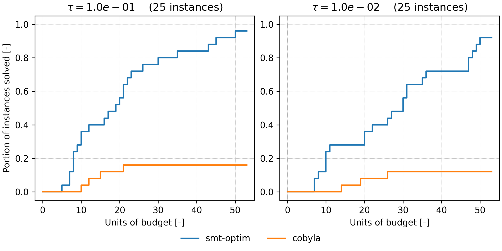

# Performance


## Performance profile and data profile

## Unconstrained optimization
This section compares `smt-optim` (EGO) with COBYLA on five global optimization problems. For each problem, five instances 
are proposed, each with a unique design of experiment (DoE), for a total of 25 instances. The data profiles below are 
used to compare the required budget to $\tau$-solve an instance. Note that COBYLA is a derivative-free local optimizer, 
whereas EGO is a global optimizer. The purpose of the benchmark below is to demonstrate the global convergence of EGO.

The five global optimization problems are the following: 
- Ackley
- Griewank
- Levy
- Rastrigin
- Schwefel

The data profile is for the two-dimensional representation of the five selected problems. Each initial DoE comprises 
three points. Cobyla started from the point with the lowest objective value.



<!---
```{list-table}
:header-rows: 1

* - Problem
  - Contour
* - Ackley
  - ```{image} misc/perf/contours/ackley_contour.png
    :scale: 35%
    :align: right
    ```
* - Griewank
  - ```{image} misc/perf/contours/griewank_contour.png
    :scale: 35%
    :align: right
    ```
* - Levy
  - ```{image} misc/perf/contours/levy_contour.png
    :scale: 35%
    :align: right
    ```
* - Rastrigin
  - ```{image} misc/perf/contours/rastrigin_contour.png
    :scale: 35%
    :align: right
    ```
* - Schwefel
  - ```{image} misc/perf/contours/schwefel_contour.png
    :scale: 35%
    :align: right
    ```
```

| Problem   | Contour                                                                        |
|-----------|--------------------------------------------------------------------------------|
| Ackley    | {width=100}                     |
| Griewank  |  |
| Levy      |                                   |
| Rastrigin |                              |
| Schwefel  |                               |

```{image} misc/perf/contours/griewank_contour.png
   :scale: 50 %
   :alt: alternate text
   :align: right
```
-->

## Constrained optimization


## Multi-fidelity optimization
